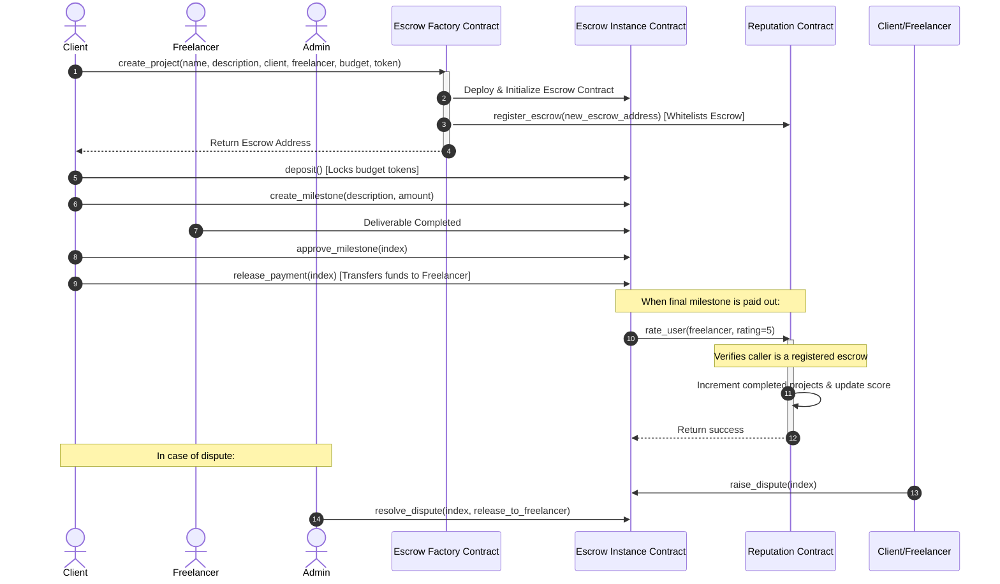

# StellarFlow Vault - Decentralized Milestone-based Escrow Platform

StellarFlow Vault is a complete, production-ready decentralized milestone-based escrow dApp built on the Stellar blockchain using Soroban smart contracts. It satisfies all specifications of the **Stellar Developers Orange Belt Challenge**.

Clients can lock budgets in escrow, dynamically configure milestone deliverables, and progressively release payments to freelancers. The platform includes a secure cross-contract Reputation system that tracks completed projects and rates freelancers automatically.

---

## Live Demo

**Vercel Deployment:**
https://stellarflow-vault-d1nz.vercel.app/

**Demo Video (Unlisted YouTube):**
https://youtu.be/X1uhvF7iCZA

---

## Smart Contract Deployment

### Reputation Contract

```text
CD3GUCIRBR3QB4HWFJR6R5FJDZBVZWDW2ZJMRRY5HYY4YV2PYPYAHRT4
```

### Escrow Factory Contract

```text
CATSAMXGYG55ZGYBAEFBQYFL6SSTGU2AZ4M7UXGB4SGWN4CSE24VRRHA
```

### Escrow WASM Hash

```text
82528c3bf10a76124873e5b61c9fd1c0023c8782a0b0037941ea069926341454
```

---

## Contract Interaction Transaction Hash

The following transaction was executed successfully on Stellar Testnet during contract initialization and configuration:

```text
04c7d686e61f5b6ce8af660cfca5c33f9e815df42097c15b7de909f0bc92196f
```

---

## CI/CD Verification

The project uses GitHub Actions to automatically:

* Build Soroban smart contracts
* Execute Rust contract tests
* Run frontend linting
* Execute Vitest unit tests
* Build the React frontend

Pipeline Status:

* Rust Contracts Tests ✅
* Frontend Tests & Build ✅

---

## Screenshots

The repository includes screenshots demonstrating:

* Mobile Responsive Dashboard
* Mobile Create Project View
* Mobile Project Details View
* Reputation Tracking Page
* Activity Feed
* CI/CD Pipeline Success
* Test Suite Passing (3+ Tests)

Screenshots are available inside the `screenshots/` directory.

---

## Demo Mode

For demonstration and judging purposes, StellarFlow Vault includes a built-in Mock Mode that simulates escrow workflows without requiring wallet funding.

The application can also be configured to interact with deployed Stellar Testnet contracts using the provided contract addresses.


---

## Technical Stack

- **Smart Contracts (Backend)**: Rust, Soroban SDK (v22), Target `wasm32v1-none`
- **Frontend App**: React, TypeScript, Vite, Tailwind CSS (v3), Lucide icons, Canvas Confetti
- **Wallet Integration**: `@creit.tech/stellar-wallets-kit` (Freighter, Albedo, xBull support)
- **Testing Suite**: Rust contract native tests, Vitest + React Testing Library frontend tests
- **Automation / Scripts**: PowerShell Core deploy script (`scripts/deploy.ps1`)
- **CI/CD**: GitHub Actions (`.github/workflows/ci.yml`)

---

## System Architecture

The project consists of 3 distinct Soroban smart contracts interacting on-chain:

1. **Reputation Contract**: Tracks freelancer metrics (`completed_projects`, `rating_count`, `reputation_score`).
2. **Escrow Factory Contract**: Programmatically deploys new Escrow instances and stores references.
3. **Escrow Contract**: Handles depositing client funds, creating milestones, tracking disputes, and releasing funds.

### Cross-Contract Payout & Reputation Flow



---

## File Structure

```
d:\StellarFlow 3/
├── .github/
│   └── workflows/
│       └── ci.yml             # GitHub Actions CI pipeline
├── contracts/
│   ├── escrow/                # Escrow smart contract code and unit tests
│   ├── escrow-factory/        # Escrow Factory smart contract
│   └── reputation/            # Reputation score tracker smart contract
├── frontend/
│   ├── src/
│   │   ├── pages/             # Dashboard, CreateProject, ProjectDetails, Reputation, ActivityFeed
│   │   ├── services/          # Stellar RPC client, wallet connectors, Sandbox mock fallback
│   │   ├── App.tsx            # Navigation, global Toast, and Wallet context
│   │   └── App.test.tsx       # Vitest tests mocking service layer
│   ├── eslint.config.js       # ESLint configurations (warn on unused-vars, no explicit any errors)
│   ├── tailwind.config.js     # Tailwind CSS setup
│   └── vite.config.ts         # Vite bundler and Vitest settings
├── scripts/
│   └── deploy.ps1             # PowerShell script compiling, deploying, and linking contracts
└── Cargo.toml                 # Cargo workspace configuration
```

---

## Development & Test Commands

### 1. Build and Run Smart Contract Tests
Run these commands in the workspace root directory:
```bash
# Compile optimized WASM binaries (targets wasm32v1-none)
stellar contract build

# Run cargo contract tests (sequentially to prevent Windows file lock conflicts)
cargo test -j 1
```

### 2. Run Frontend Tests & Build
Navigate to the `frontend/` directory:
```bash
cd frontend

# Run frontend ESLint linter
npm run lint

# Run Vitest unit tests
npx vitest run

# Run production build (compiles JS chunks and CSS)
npm run build

# Start local hot-reloaded development server
npm run dev
```

---

## Deployment & Setup Guide

### Dynamic Deployment Automation
We provide a PowerShell Core script (`scripts/deploy.ps1`) to compile, deploy, and link the contracts in a single click:

```powershell
# Open PowerShell and run the deployment script
# By default, this will target the Stellar Testnet
./scripts/deploy.ps1 -Network "testnet" -DeployerName "my_deployer_identity"
```

The script will:
1. Compile the smart contracts using `stellar contract build`.
2. Generate or load the deployer account identity.
3. Deploy the **Reputation Contract** to the network.
4. Install/Upload the **Escrow Wasm** bytecode to obtain the Wasm hash.
5. Deploy the **Escrow Factory Contract** with the Reputation address and Escrow Wasm hash.
6. Invoke `set_factory` on the Reputation Contract to whitelist the Factory.
7. Write the deployed addresses and network settings to `frontend/src/services/deployed_config.ts`.

---

## Design Choices & Integrity

1. **Explicit Caller Auth (`require_auth()`)**: Handled the lack of standard `env.caller()` inside Soroban SDK 22 by passing explicit `caller: Address` arguments to state-modifying functions and immediately running `caller.require_auth()`.
2. **Sandbox Mock Mode Fallback**: A fully responsive simulation layer storing data in `localStorage` allows instant UI testing without requiring funded Testnet wallets. The system automatically offers a "Sandbox Mode" toggle in the sidebar.
3. **Cross-Contract Security whitelisting**: The Reputation contract ensures that only whitelisted escrow contracts registered by the Factory can call `rate_user` to increment scores.

---

## Challenge Requirements Coverage

| Requirement                           | Status |
| ------------------------------------- | ------ |
| Public GitHub Repository              | ✅      |
| Complete README Documentation         | ✅      |
| 10+ Meaningful Commits                | ✅      |
| Live Demo Deployment                  | ✅      |
| Smart Contract Deployment             | ✅      |
| Contract Interaction Transaction Hash | ✅      |
| Mobile Responsive UI                  | ✅      |
| CI/CD Pipeline                        | ✅      |
| 3+ Passing Tests                      | ✅      |
| Demo Video                            | ✅      |

---

## Repository

GitHub Repository:

https://github.com/akash-mondal-1/stellarflow-vault
